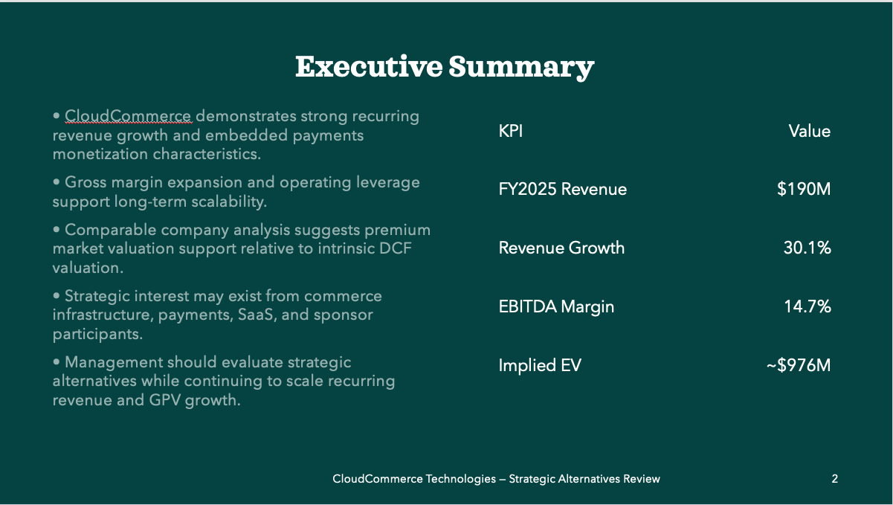
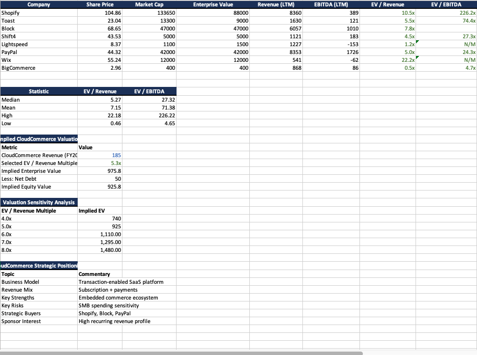
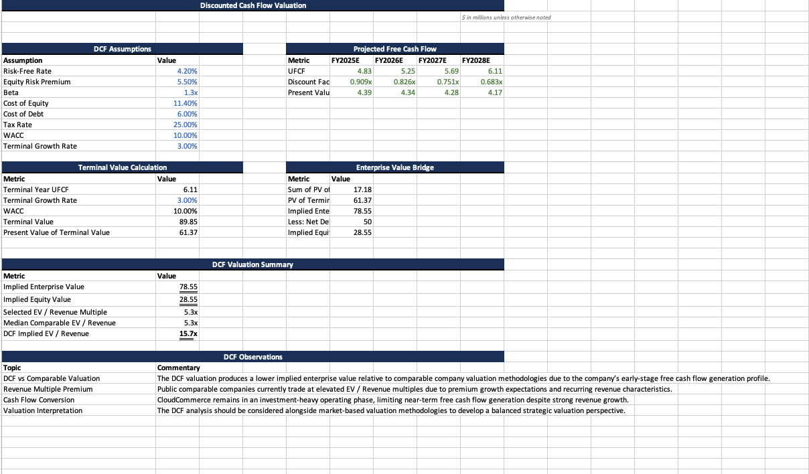
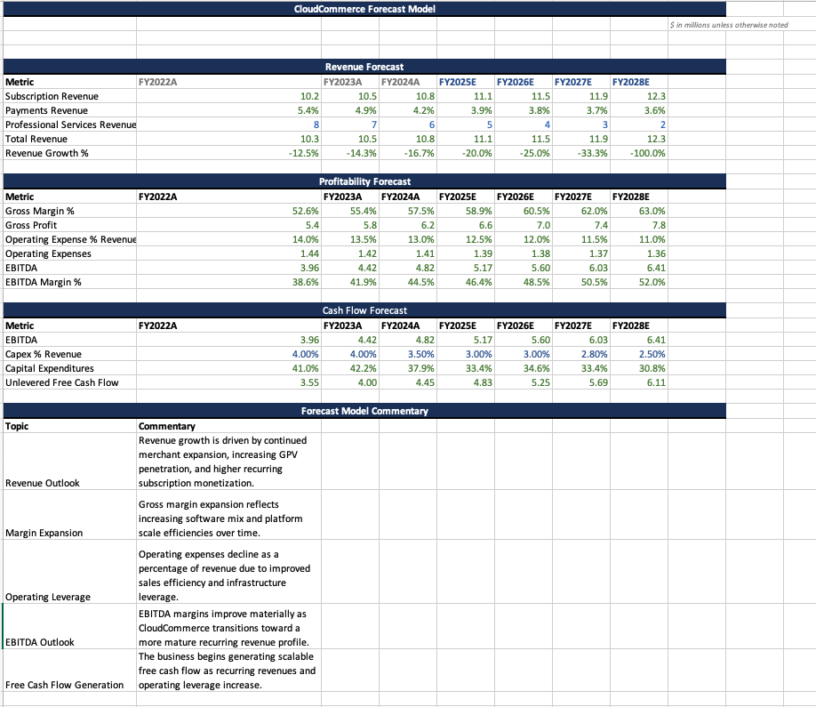
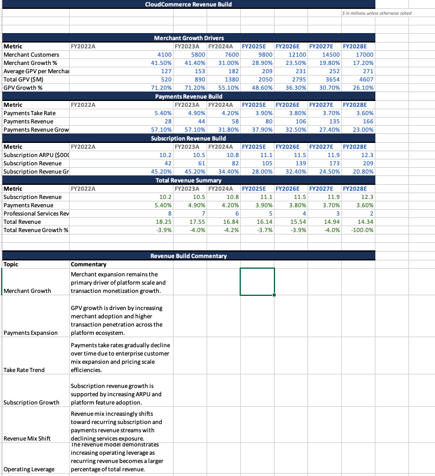
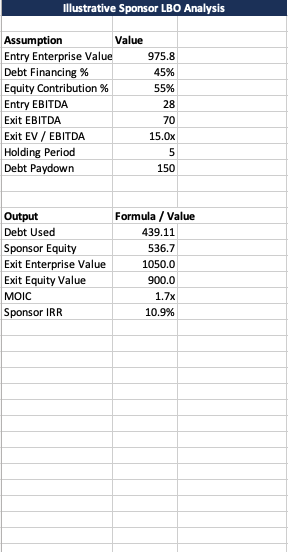
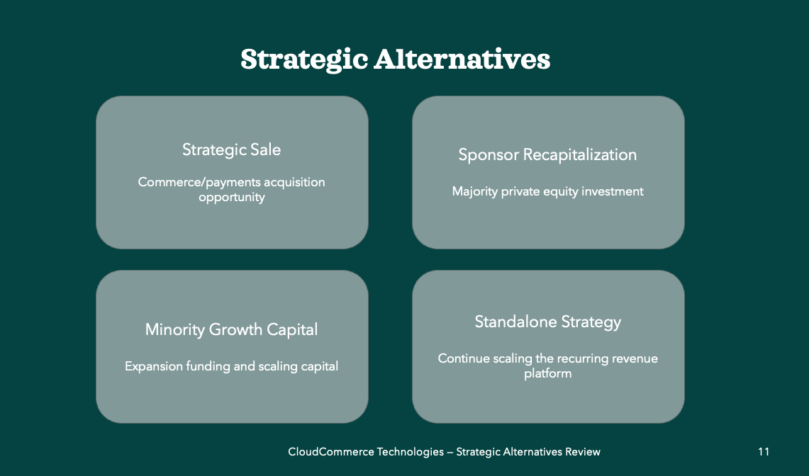
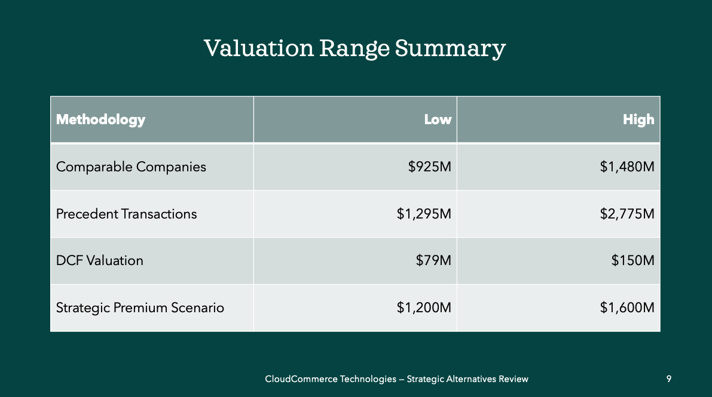

# CloudCommerce Technologies Strategic Alternatives Review

## Project Overview

This project simulates an investment banking-style strategic alternatives review for a fictional mid-market commerce infrastructure and embedded payments platform, CloudCommerce Technologies.

The engagement was designed to replicate the analytical, valuation, and strategic advisory workflows commonly performed by Investment Banking Analysts and Associates at firms such as Bank of America, Goldman Sachs, JPMorgan, Moelis, Evercore, and PJT Partners.

The project evaluates strategic alternatives, valuation positioning, operating scalability, and transaction attractiveness through integrated financial modeling, executive presentation development, and board-style strategic advisory materials.

---

## Investment Banking Scope

The project includes:

- Comparable company analysis
- Discounted cash flow (DCF) valuation
- Precedent transaction analysis
- Illustrative sponsor LBO analysis
- Revenue forecast modeling
- Operating leverage analysis
- Strategic alternatives evaluation
- Buyer universe analysis
- Executive-level board presentation materials
- Investment banking-style strategic recommendation framework

---

## Screenshots

### Executive Summary


### Comparable Company Analysis


### DCF Valuation


### Forecast Model


### Revenue Build


### Sponsor LBO Analysis


### Strategic Alternatives


### Valuation Summary


## Company Profile

CloudCommerce Technologies is a fictional transaction-enabled SaaS and embedded payments platform serving SMB and mid-market ecommerce merchants.

The company generates revenue through:
- subscription software
- embedded payments monetization
- merchant transaction enablement
- commerce infrastructure services

The strategic review evaluates CloudCommerce as a potential:
- strategic acquisition target
- sponsor-backed recapitalization candidate
- standalone scaling platform

---

## Key Analyses

### Comparable Company Analysis

Benchmarked CloudCommerce against public recurring revenue and embedded fintech platforms including:

- Shopify
- Toast
- Block
- Shift4
- PayPal
- Wix
- Lightspeed
- BigCommerce

Analyzed:
- EV / Revenue
- EV / EBITDA
- growth profiles
- operating margins
- Rule of 40 performance

---

### Discounted Cash Flow Valuation

Built a DCF valuation model analyzing:
- revenue growth
- EBITDA expansion
- operating leverage
- UFCF generation
- WACC assumptions
- terminal value sensitivity

---

### Precedent Transactions Analysis

Evaluated strategic M&A transaction benchmarks across:
- embedded fintech
- ecommerce infrastructure
- SMB SaaS
- payments enablement platforms

Included transactions such as:
- Block / Afterpay
- Intuit / Mailchimp
- Shopify / Deliverr
- Shift4 / Finaro

---

### Illustrative Sponsor LBO Analysis

Developed a sponsor acquisition scenario evaluating:
- debt financing structure
- sponsor equity contribution
- exit valuation assumptions
- sponsor MOIC
- sponsor IRR

---

### Strategic Alternatives Analysis

Evaluated:
- strategic sale opportunities
- sponsor recapitalization scenarios
- minority growth investment alternatives
- standalone operating strategy

---

## Key Strategic Takeaways

- Recurring revenue commerce infrastructure platforms continue to command premium public market valuation multiples.
- Embedded payments monetization and GPV expansion support long-term operating scalability.
- Comparable company valuation currently supports stronger implied valuation outcomes than intrinsic DCF analysis due to early-stage free cash flow characteristics.
- Strategic acquirers and financial sponsors may view CloudCommerce as an attractive embedded fintech expansion platform.

---

## Skills Demonstrated

- DCF valuation
- Comparable company analysis
- Precedent transaction analysis
- LBO modeling
- Revenue forecasting
- Operating model development
- EBITDA and operating leverage analysis
- Strategic alternatives analysis
- Investment banking presentation development
- Executive-level strategic communication
- Board-style financial storytelling

---

## Repository Structure

```text
mid-market-tech-strategic-review
│
├── excel-model
├── presentation
├── outputs
├── screenshots
├── docs
├── research
└── README.md
